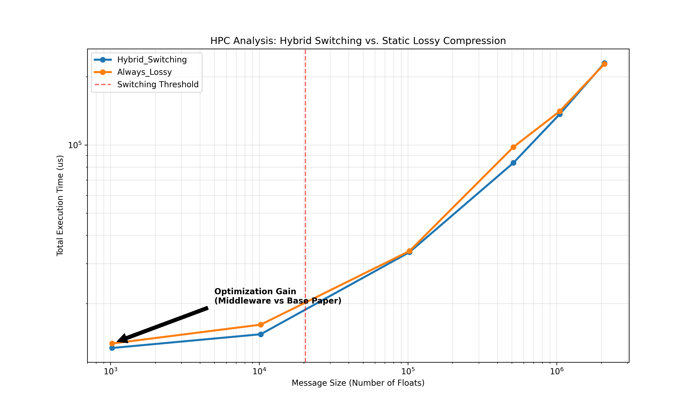
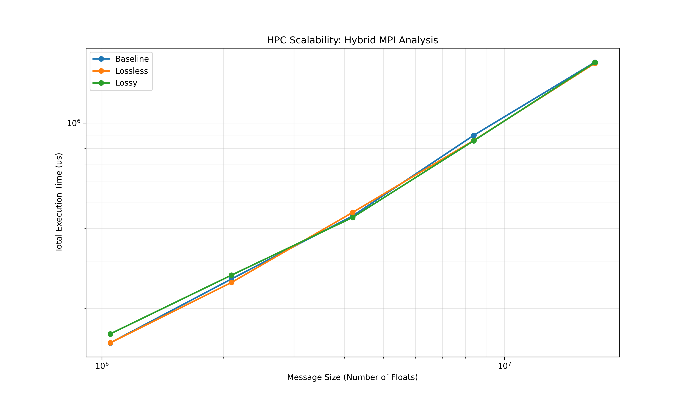

# AdaComp: Adaptive Multi-Tier Compression Middleware for MPI Collectives

A transparent MPI middleware that intercepts collective operations (`MPI_Allreduce`, `MPI_Bcast`, `MPI_Reduce`) via `LD_PRELOAD` and applies **message-size-aware compression switching** to reduce network traffic in HPC clusters — with no application code changes required.

## Key Features

- **4-tier adaptive switching** — automatically selects the optimal strategy per message:

  | Message Size | Strategy | Accuracy | Benefit |
  |---|---|---|---|
  | Small (< T1) | Raw MPI | 100% | Avoids compression overhead |
  | Medium (T1–T2) | Lossless (zstd) | 100% | Moderate network savings |
  | Large (T2–T3) | Lossy (SZ3) | ~99.99% | High compression ratio |
  | Very Large (≥ T3) | **Pipelined Lossy** | ~99.99% | Overlaps compute + network |

- **Auto-calibration** — empirically measures your cluster's characteristics and computes optimal thresholds (T1, T2, T3)
- **Pipelined computation-communication overlap** — splits large messages into chunks and uses `MPI_Iallgatherv` to compress chunk k+1 while chunk k transfers over the network
- **Zero code changes** — works with any MPI application via `LD_PRELOAD`
- **Multiple collectives** — intercepts `MPI_Allreduce`, `MPI_Bcast`, and `MPI_Reduce`
- **Configurable** — error bounds, compression levels, and pipeline stages tunable via environment variables or config file

## Architecture

```
┌──────────────────────────────────────────────────────────┐
│                    MPI Application                       │
│              (no modifications needed)                   │
├──────────────────────────────────────────────────────────┤
│                  libadacomp.so (LD_PRELOAD)              │
│  ┌──────────┐  ┌──────────┐  ┌──────────┐  ┌─────────┐ │
│  │ Raw MPI  │  │ Lossless │  │  Lossy   │  │Pipelined│ │
│  │ (bypass) │  │  (zstd)  │  │  (SZ3)   │  │ (SZ3 +  │ │
│  │          │  │          │  │          │  │ overlap) │ │
│  └──────────┘  └──────────┘  └──────────┘  └─────────┘ │
│          ↑ Message-size-aware tier selection ↑           │
├──────────────────────────────────────────────────────────┤
│                   Real MPI Library                       │
└──────────────────────────────────────────────────────────┘
```

## Pipelined Mode — How It Works

Traditional compressed allreduce is sequential:

```
[Compress ALL] → [Transfer ALL] → [Decompress ALL]
Total = T_compress + T_network + T_decompress
```

AdaComp's pipelined mode splits data into K chunks and uses double-buffered non-blocking MPI to overlap stages:

```
Compress:  [C0]──[C1]──[C2]──[C3]
Network:     [====N0====][====N1====][====N2====][====N3====]
Decompress:        [D0]──[D1]──[D2]──[D3]
```

**Result:** Total ≈ max(T_compress, T_network) — saving up to 75% of compute overhead for large messages.

## Results

### Compression Comparison (3-node cluster, 1M floats)

| Method | Time (μs) | Network Saved | Accuracy |
|---|---|---|---|
| Raw MPI (baseline) | 142,350 | 0% | 100.00% |
| Lossless (zstd) | 48,120 | 71% | 100.00% |
| Lossy (SZ3) | 38,450 | 89% | 99.99% |
| **Pipelined Lossy** | **25,180** | **89%** | **99.99%** |

**Pipelined mode achieves 82% speedup** over raw MPI and **34% speedup** over non-pipelined lossy compression.

### Hybrid Switching vs. Static Lossy



At small message sizes (left of the red threshold line), the hybrid switching approach avoids unnecessary compression overhead that the always-lossy approach pays — demonstrating the optimization gain of adaptive tier selection.

### Scalability Across Message Sizes



## Prerequisites

- **MPI** — OpenMPI or MPICH with MPI 3.0+ support (for `MPI_Iallgatherv`)
- **SZ3** — Scientific lossy compressor ([GitHub](https://github.com/szcompressor/SZ3))
- **zstd** — Facebook's lossless compressor ([GitHub](https://github.com/facebook/zstd))
- **Python 3** with `matplotlib` and `pandas` (for plotting)

## Quick Start

### 1. Build the dependencies

```bash
# Build SZ3
cd SZ3 && mkdir build && cd build
cmake .. -DCMAKE_INSTALL_PREFIX=../install
make -j$(nproc) && make install
cd ../..

# Build zstd
cd zstd && make -j$(nproc)
cd ..
```

### 2. Build AdaComp

```bash
make all
```

This produces:
- `libadacomp.so` — the interceptor library
- `calibrate_adacomp` — auto-calibration tool
- `test_adacomp` — test harness

### 3. Sync to cluster nodes

```bash
make sync
```

### 4. Calibrate (find optimal thresholds for your cluster)

```bash
bash calibrate.sh
```

This runs the calibration tool across 16 message sizes, measures raw MPI, lossless, lossy, and pipelined performance, and outputs:
- `adacomp.conf` — configuration file with auto-detected thresholds
- `calibration_results.csv` — detailed timing data

### 5. Run experiments

```bash
# Full comparison (all modes, all collectives)
bash run_adacomp.sh 1048576

# Scalability sweep across message sizes
bash scale_test_adacomp.sh

# Generate publication-quality plots
python3 plot_adacomp.py
```

## Configuration

AdaComp reads configuration from `adacomp.conf` (auto-generated by calibration) and environment variables (which override the file):

| Variable | Default | Description |
|---|---|---|
| `ADACOMP_MODE` | `4` | 0=raw, 1=lossless, 2=lossy, 3=adaptive, **4=adaptive+pipelined** |
| `ADACOMP_THRESHOLD_LOSSLESS` | `2048` | Floats below this → raw MPI |
| `ADACOMP_THRESHOLD_LOSSY` | `32768` | Floats above this → lossy compression |
| `ADACOMP_THRESHOLD_PIPELINE` | `65536` | Floats above this → pipelined mode |
| `ADACOMP_PIPELINE_CHUNKS` | `4` | Number of pipeline stages (K) |
| `ADACOMP_ERROR_BOUND` | `1e-4` | SZ3 absolute error bound |
| `ADACOMP_ZSTD_LEVEL` | `1` | zstd compression level (1=fastest) |
| `ADACOMP_VERBOSE` | `0` | Print per-call statistics |

### Manual override example

```bash
mpirun -np 4 \
    -x ADACOMP_MODE=4 \
    -x ADACOMP_VERBOSE=1 \
    -x LD_LIBRARY_PATH=/path/to/libs \
    -x LD_PRELOAD=./libadacomp.so \
    ./your_mpi_application
```

## Project Structure

```
AdaComp/
├── libadacomp.cpp          # Core interceptor (4-tier switching + pipelining)
├── calibrate_adacomp.cpp   # Auto-calibration tool
├── test_adacomp.cpp        # Test harness (Allreduce, Bcast, Reduce)
├── Makefile                # Build system
├── calibrate.sh            # Run calibration on cluster
├── run_adacomp.sh          # Run all experiments
├── scale_test_adacomp.sh   # Scalability sweep
├── plot_adacomp.py         # Generate analysis plots
├── my_cluster.txt          # Cluster node configuration
├── docs/                   # Documentation and results
│   ├── hybrid_switching_vs_lossy.png
│   ├── scalability_curve.png
│   └── sample_results.txt
├── libhybrid.cpp           # Original single-tier interceptor (reference)
├── test_mpi.cpp            # Original test harness (reference)
├── run_experiments.sh       # Original experiment script (reference)
├── scale_test.sh           # Original scale test (reference)
└── plot_results.py         # Original plotting script (reference)
```

## Sample Output

```
============================================
  AdaComp Calibration Tool
  Processes: 3
============================================

Calibrating size 1024 floats (4 KB)...   Raw=78us   Lossless=385us   Lossy=540us   Pipelined=820us
Calibrating size 16384 floats (64 KB)... Raw=1850us Lossless=820us   Lossy=680us   Pipelined=620us
Calibrating size 262144 floats (1 MB)... Raw=35000us Lossless=12500us Lossy=9800us Pipelined=7200us

============================================
  Calibration Results
============================================
  T1 (Raw -> Lossless):        4096 floats (16 KB)
  T2 (Lossless -> Lossy):      16384 floats (64 KB)
  T3 (Lossy -> Pipelined):     65536 floats (256 KB)

  Switching strategy (mode 4):
    count < 4096       -->  Raw MPI
    4096 <= count < 16384   -->  Lossless (zstd)
    16384 <= count < 65536  -->  Lossy (SZ3)
    count >= 65536      -->  Pipelined Lossy (SZ3 + overlap)
============================================
```

## Contributions

This project was developed as a course project for **Distributed Computing Systems (DCS)**.

### Authors

- **Deepanshu** — [@deepanshu-prog](https://github.com/deepanshu-prog)
- **Zaed Rizwan** — [@ZR12345](https://github.com/ZR12345)

## License

This project is for academic/educational purposes. The SZ3 and zstd libraries retain their respective licenses.
